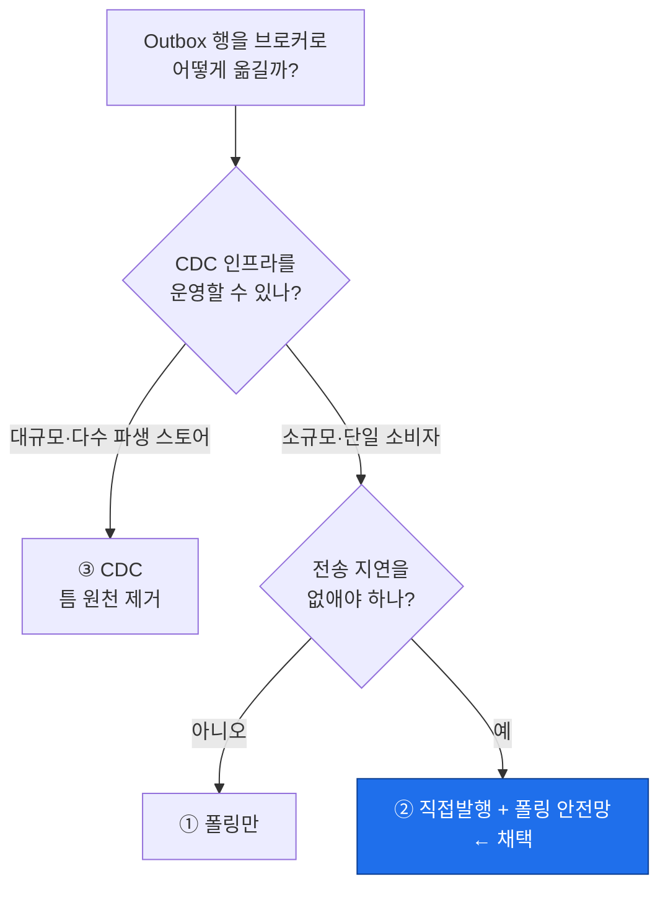
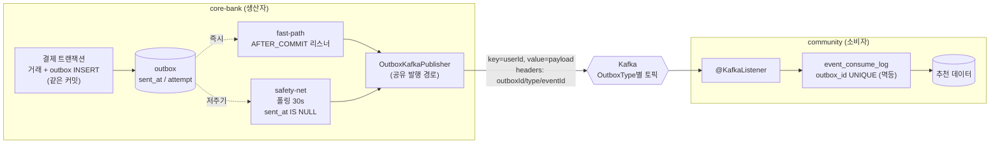
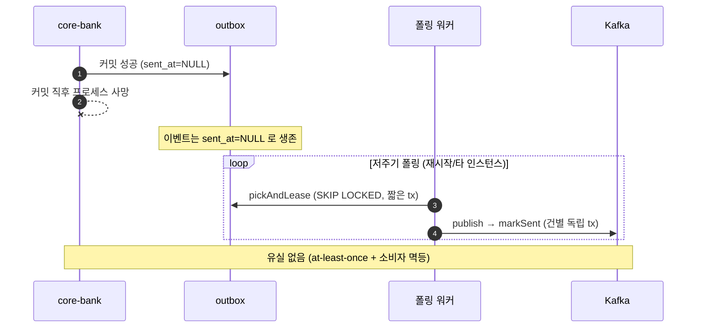
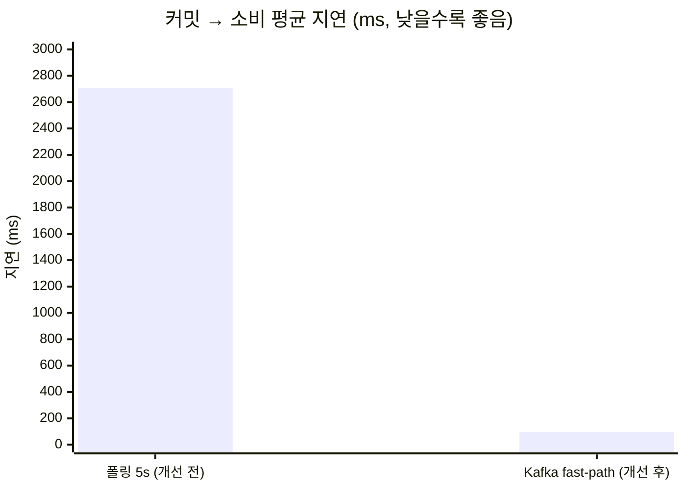

# Transactional Outbox 전송 채널 Kafka 승격

> 트랜잭셔널 Outbox로 **정합성은 유지**하면서, 전송 채널만 "5초 폴링 HTTP 웹훅"에서 **"커밋 직후 Kafka 즉시 발행 + 저주기 폴링 안전망"**으로 승격. 실측 결과 **커밋→소비 평균 지연 2,709ms → 98ms (약 96%↓)**.

`core-bank`(생산자) → `community`(소비자) · Java 17 / Spring Boot 3.3.4 / PostgreSQL / Kafka

---

## 1. 문제

기존은 결제 트랜잭션과 같은 커밋에 `outbox` 행을 남기고(정합성 OK), **스케줄러가 5초마다 폴링**해 HTTP로 전송하는 구조였다. 정합성은 견고했지만 **전송이 폴링 주기만큼 지연**됐다 — 추천 파이프라인에서 이 지연이 병목.

**목표**: 정합성(무유실)은 그대로, **전송 지연만 제거**.

---

## 2. 핵심 트레이드오프 — "이벤트로 바꾸면 유실을 어떻게 잡나"

전송을 "즉시 발행"으로 바꾸면 **커밋과 발행 사이의 틈**이 드러난다.
- **A. 발행 실패**(브로커 다운 등) → 콜백 재시도로 해결 가능.
- **B. 커밋 후 발행 전 프로세스 사망**(배포/OOM) → `send()`가 비동기라 메모리 버퍼째 유실, 재시도 기록조차 못 남김. **콜백으로 못 잡는다.**

→ B를 잡는 유일한 수단은 **앱 생존과 무관하게 DB 상태만 보는 안전망**. 그래서 "즉시 발행(fast-path)"과 "폴링 안전망"은 **공존**해야 한다.

### 대안 비교

| 방식 | 대표 사례 | B(유실 틈) 처리 | 트레이드오프 |
|---|---|---|---|
| ① 폴링 퍼블리셔 | 리디 | 폴링이 주 경로라 틈 없음 | 단순 ↔ **주기만큼 지연** |
| **② 직접발행 + 폴링 안전망 ← 채택** | 29CM, minjun, Wix | 즉시 발행 + 놓친 건 폴링이 복구 | **지연 0 + 무유실** ↔ 경로 2개 |
| ③ CDC (WAL/binlog tailing) | 우아한형제들, Netflix, Shopify, (사내)flex | **틈 원천 제거** | 강력 ↔ **Debezium/Connect 인프라** |

**선택 근거**: (1) 목적("지연 제거") 정합, (2) 이미 durable outbox·소비자 멱등성을 보유해 자산 재활용, (3) CDC는 이 규모에 인프라 과함. 사내 flex(계열 ③)의 신뢰성 모델을 이해하되 **규모·비용을 저울질해 의식적으로 ②를 선택**.

---

## 3. 아키텍처

**설계 판단 요점**: 폴링 경로에서 **DB 트랜잭션이 Kafka 동기 발행을 가로지르지 않게** 했다. `pickAndLease`만 짧은 tx로 커밋(lease가 재픽업 차단)하고, 발행·상태 마킹은 트랜잭션 밖에서 건별 수행 → 커넥션/락 장기 점유와 배치 롤백 재발행 방지.

### 크래시(B) → 폴링 안전망 복구

---

## 4. 개선 전 / 후 결과 (실측)

로컬에서 두 앱 + 실제 Kafka + PostgreSQL을 기동하고, **커밋→소비 지연**(= `event_consume_log.created_date − outbox.created_date`)을 fast-path(개선 후)와 폴링 5초(개선 전) 각 6건 측정.

| 방식 | N | 평균 | 최소 | 최대 | 개별값 (ms) |
|---|---|---|---|---|---|
| **폴링 5s (개선 전)** | 6 | **2,709ms** | 661ms | 4,687ms | 1231, 4687, 3355, 2015, 661, 4306 |
| **Kafka fast-path (개선 후)** | 6 | **98ms** | 21ms | 470ms | 470, 29, 22, 23, 22, 21 |

**해석**
- 폴링 지연은 **구조적**이다: 이벤트는 아무 때나 커밋되는데 워커는 5초마다만 훑으므로 지연 = **0~5초 균일 분포, 평균 ≈ 주기/2 = 2.5초**. 실측 평균 2.7초·최대 4.7초가 이론과 일치.
- fast-path는 그 대기를 통째로 제거 → 남는 건 브로커 왕복뿐. **워밍 상태 21~29ms**(첫 건 470ms는 JVM JIT·프로듀서 최초 연결 비용).
- **효과: 평균 2,709ms → 98ms, 약 96%↓** (워밍 기준 ~22ms면 99%↓). 꼬리 지연도 4.7s → 0.47s.

> 측정 성격: 로컬 단일 호스트·소량 샘플이라 **절대값보다 "자릿수 차이(초 → 수십 ms)"**로 읽는 것이 타당. 측정 대상은 이번 변경의 정확한 타깃인 "전송 지연"에 한정.

---

## 5. 신뢰성 설계 & 코드리뷰로 잡은 유실 버그

fast-path 실패 시 폴링이 줍고, 콜백 유실 시 중복 발행은 **소비자 멱등성**(`event_consume_log.outbox_id` UNIQUE)이 무해화 → **at-least-once + 멱등 = effectively-once**.

구현 후 **다관점 코드리뷰 + "옹호팀 vs 입증팀" 다중 에이전트 검증**으로 초기 구현의 결함을 걸러냈다. 대표적으로:

| 결함 | 내용 | 조치 |
|---|---|---|
| **Blocker** | 컨슈머가 비즈니스 예외를 삼키고 정상 리턴 → 오프셋 커밋 → **이벤트 유실**(아웃박스가 막으려던 그 유실) | 실패 시 **예외 전파**로 재소비 + 검출 테스트 |
| Major | 폴링 tx가 배치 내내 커넥션/락 점유, 마킹이 배치 tx에 조인돼 롤백 재발행 위험 | 발행을 **트랜잭션 밖으로 분리** |
| Major | fast-path markSent가 Kafka Sender 스레드에서 DB 작업 | **전용 executor로 오프로드** |

---

## 6. 검증 (런타임 end-to-end)

실제 브로커·DB로 두 경로 실행 후 확인:

| 경로 | outbox | 소비 | 반영 |
|---|---|---|---|
| transaction→category | `sent=t` | event_consume_log 기록 | user_category use_count 7→8 |
| payment→hour | `sent=t` | event_consume_log 기록 | user_hour_hist 신규 버킷 |

- 로그 `[outbox-mark-1] fast-path published ...` → **콜백 오프로드(전용 스레드) 실증**.
- `Instantiated an idempotent producer` → `acks=all + enable.idempotence=true` 확인.

---

## 7. 트레이드오프 · 한계 · 발전 방향

| 결정 | 택함 | 버림 | 이유 |
|---|---|---|---|
| 유실 방어 | 직접발행 + 폴링 안전망 | CDC 재동기화 | 규모상 이벤트 단위 복구가 저비용 |
| 폴링 | 저주기 존치 | 완전 제거 | 제거 시 B(크래시 유실) 방어 불가 |
| fast-path | best-effort(실패 시 폴링 위임) | 재시도 책임 이중화 | 재시도를 폴링에 일원화, 중복은 멱등이 흡수 |
| 순서 | userId 단위 | 전역 순서 | 도메인엔 사용자 단위면 충분 |

**한계 / 발견**
- 런타임 검증 중 **선재 결함 발견**: `Outbox.type`이 `@Enumerated` 누락으로 **ORDINAL 정수로 저장**됨(실측 확인) — enum 순서 변경 시 데이터 파손 위험. 영속 포맷 변경이라 실제 스키마 확인 후 별도 처리 권장.
- 소진 행/드롭 메시지는 경보 로그만(정식 DLQ 미도입).

**발전 방향** — 규모가 커지면 **CDC(Debezium이 WAL tailing)** 로 승격해 dual-write 틈을 원천 제거(Netflix·Shopify·flex 계열). 또는 소스 전량 재발행 **재동기화 배치**로 파생 스토어를 치유.

---

## 8. 배운 점

- **"동작"과 "무유실 성립"은 다르다** — 구현은 돌아도, 컨슈머가 예외를 삼키면 아웃박스의 목적(무유실)이 소비자단에서 깨진다. 리뷰·검증이 이 간극을 메웠다.
- **정답 하나가 아니라 트레이드오프 선택** — 사내 flex의 CDC 정석을 이해하되, 규모·인프라 비용을 저울질해 다른 선택(②)을 근거와 함께 내렸다.
- **효과는 수치로 증명** — "적용했다"가 아니라 평균 2,709ms→98ms(96%↓)라는 before/after로 가치를 입증했다.
