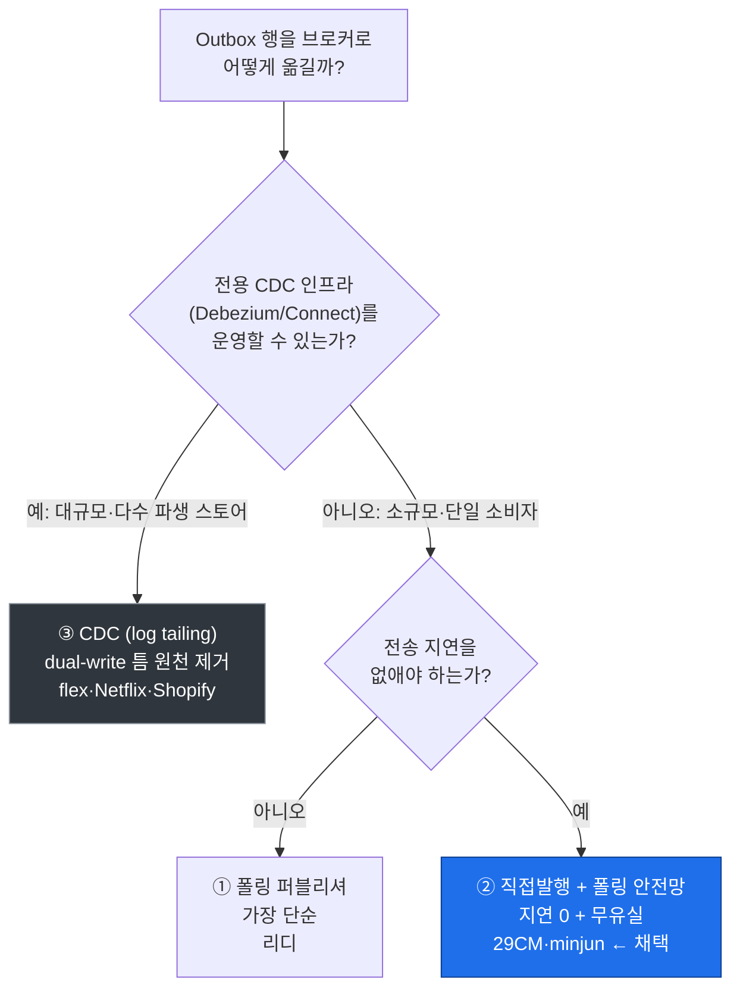
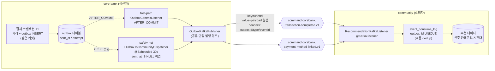
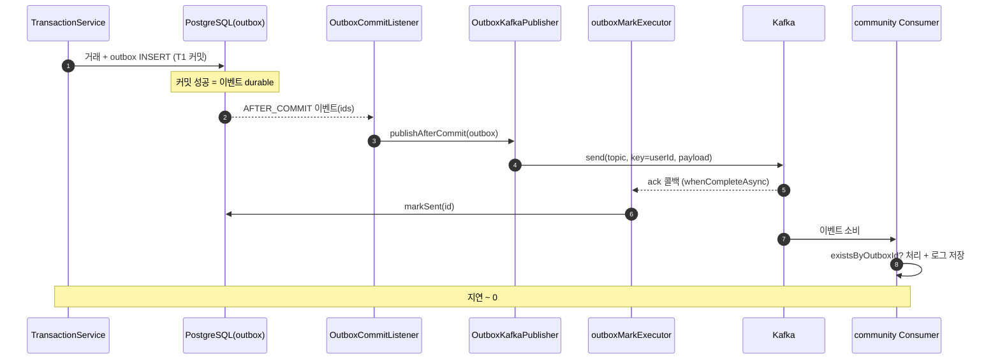
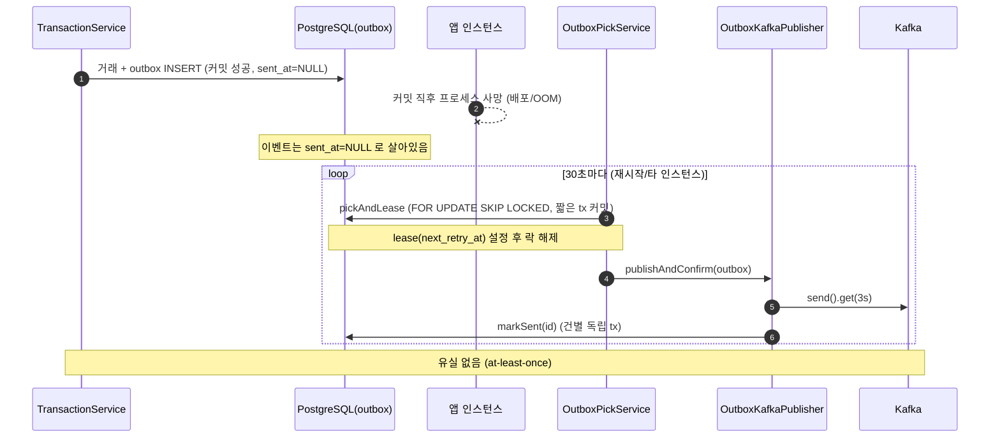
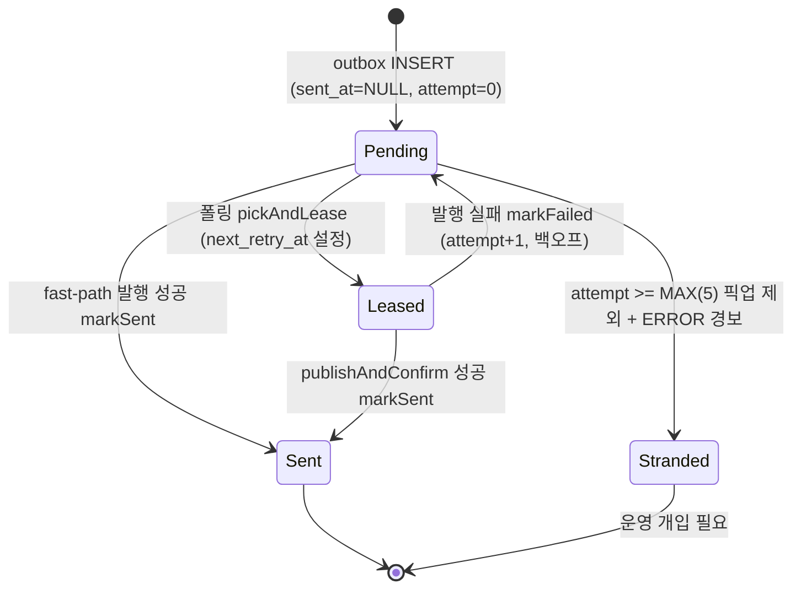

# Outbox 전송 채널 Kafka 승격 — 설계 · 대안 비교 · 의사결정 기록

> **한 줄 요약**: 트랜잭셔널 Outbox로 정합성을 유지한 채, 전송 채널만 "5초 폴링 HTTP 웹훅"에서 **"커밋 직후 Kafka 즉시 발행(fast-path) + 저주기 폴링 안전망(safety-net) + 멱등 소비"**로 승격해, 무유실을 유지하면서 전송 지연을 제거했다.

- 작성일: 2026-07-28 · 대상 모듈: `core-bank`(생산자) → `community`(소비자) · 스택: Java 17 / Spring Boot 3.3.4 / PostgreSQL / Kafka(KRaft)
- 이 문서는 **"왜 이 구조를 택했는가"의 의사결정 기록**이다. 국내외 실제 사례 10여 건과 사내(flex) 검색 색인 구조를 조사해 대안을 저울질했고, 코드리뷰·다중 에이전트 검증으로 초기 구현의 결함(컨슈머 유실 등)을 잡아냈다.

---

## 1. 문제 — 폴링의 구조적 지연

기존 구조는 결제 트랜잭션 안에서 `outbox` 테이블에 이벤트를 기록하고, 스케줄러가 **5초 주기로 폴링**해 `community`로 HTTP POST 하는 방식이었다.

- 정합성은 견고했다: 도메인 변경과 outbox 기록이 **같은 트랜잭션**(트랜잭셔널 아웃박스)이라, "결제는 됐는데 이벤트는 안 남는" 일이 없다.
- 그러나 **전송이 폴링 주기(최대 5초 + 초기 지연 2초)만큼 지연**된다. 이벤트가 즉시 흘러야 하는 추천 파이프라인에서 이 지연이 병목이었다.

**목표**: 정합성(무유실)은 그대로 두고, 전송 지연만 제거한다.

---

## 2. 배경 개념 — dual-write 문제와 왜 Outbox인가

한 번의 결제 처리에서 우리는 **서로 다른 두 저장소**에 써야 한다: **DB**(거래 + 이벤트)와 **메시지 브로커**(전송). DB 트랜잭션은 DB 안만 원자적으로 묶으므로, 이 둘을 동시에 원자적으로 쓰는 것은 (2PC 없이는) 불가능하다 — 이것이 **dual-write 문제**다.

Outbox 패턴의 본질은 이 문제를 **"일단 DB 한 곳에만 원자적으로 쓴다"**로 축소하는 것이다. 이벤트를 `outbox` 행으로 도메인 변경과 같은 트랜잭션에 넣으면, "커밋되면 이벤트도 반드시 존재"가 보장된다. 남는 문제는 단 하나 — **"그 outbox 행을 누가·언제 브로커로 옮기는가"**이다. 이 지점의 선택이 이 설계의 전부다.

---

## 3. 핵심 질문 — "폴링을 이벤트 발행으로 바꾸면, 유실을 어떻게 잡는가"

전송을 "즉시 발행"으로 바꾸면 빨라지지만, **커밋과 발행 사이의 틈**이 드러난다.

- **A. 발행 자체가 실패** — 브로커 다운, ISR 미달(`acks=all`), 버퍼 포화, 직렬화 실패. → 콜백에서 잡아 **재시도**로 처리 가능.
- **B. 커밋은 됐는데 발행을 못 함** — 커밋 직후 프로세스가 죽음(배포 SIGKILL, OOMKilled, 스케일다운, 노드 장애). `send()`가 비동기라 버퍼(메모리)의 메시지는 소실되고 **실패 기록조차 못 남긴다.** → 콜백 재시도로 **못 잡는다.**

**B를 잡는 유일한 수단은 앱 생존과 무관하게 DB 상태만 보고 동작하는 안전망**이다. 즉 "즉시 발행"은 지연을 없애는 fast-path일 뿐이고, **유실을 근절하려면 별도의 안전망이 반드시 공존해야 한다.** 이 문서의 나머지는 "어떤 안전망을 택할 것인가"의 비교다.

---

## 4. 대안 비교 — 여러 선택지를 저울질

### 4.1 "Outbox → 브로커" 이동 주체: 3가지 계열

| 계열 | 이동 주체 | 대표 사례 | B(dual-write 틈) 처리 | 트레이드오프 |
|---|---|---|---|---|
| **① 폴링 퍼블리셔** | 워커가 outbox를 폴링→발행 | **리디**(CDC 의도적 배제) | 폴링이 곧 주 경로라 틈 자체가 없음 | 운영 단순 ↔ **폴링 주기만큼 지연**(리디는 60초 초과 알림) |
| **② 직접발행 + 폴링 안전망** | 커밋 직후 즉시 발행, 놓친 건 폴링이 복구 | **29CM, minjun.blog, Wix** | 평시 즉시 발행, ①②틈은 안전망이 사후 복구 | **지연 ≈ 0 + 안전** ↔ 경로 2개라 로직 복잡 |
| **③ CDC (로그 tailing)** | Debezium이 DB WAL/binlog를 읽어 발행 | **우아한형제들, Netflix, Shopify, Airbnb, (사내)flex** | **틈을 원천 제거** — 앱 생존과 무관하게 로그만 읽음 | near-realtime·DB부하 낮음 ↔ **Kafka Connect+Debezium 인프라 운영** |

### 4.2 "유실 안전망"의 4가지 방식

같은 목적(유실 복구)이라도 실제 회사들이 쓰는 메커니즘은 다르다.

| 안전망 | 어떻게 | B(크래시 유실)를 막나 | 대표 사례 |
|---|---|---|---|
| **폴링 안전망** | outbox `sent_at IS NULL`를 저주기 스캔·재발행 | **막음** — DB 커밋이 진실, 앱과 무관 | 29CM(10분 경과분 재발행), minjun |
| **재동기화 배치** | **소스 DB 전체**를 주기적 재스캔→전량 재발행(`CORRECTION`), 멱등 소비로 중복 무해화 | **막음** — outbox 없이 소스가 진실 | (사내)flex, Netflix DBLog, Shopify, Airbnb |
| **SQS/DLQ fallback** | 발행 실패 시 별도 큐(SQS)에 임시 보관·재시도, 소진 시 DLQ | **부분** — "발행 시도 전 크래시"는 못 담음 | Grab, Wix(S3 fallback) |
| **오프셋 게이팅** | (CDC/컨슈머) 실패분 남으면 오프셋 커밋 안 함 | 소비 재시도만 보장(발행측 틈은 CDC가 담당) | 하이퍼커넥트, 카카오페이증권 |

### 4.3 결정 트리

---

## 5. 결정 — ② 직접발행 + 폴링 안전망 (계열 A)

**채택**: 커밋 직후 Kafka 즉시 발행(fast-path) + 기존 폴링 워커를 저주기(30~60초) 안전망으로 강등 + 기존 멱등 소비 재사용.

**근거 (확신도 85%)**:
1. **목적 정합** — "폴링 지연 제거"를 정확히 달성. fast-path가 지연을 없애고, 폴링은 B만 줍는 안전망으로만 잔존.
2. **기존 자산 재활용** — 이 프로젝트엔 이미 durable outbox 테이블(`sent_at`, `attempt`, `FOR UPDATE SKIP LOCKED`)과 소비자 멱등성(`event_consume_log.outbox_id` UNIQUE)이 있다. flex가 commons 라이브러리에 캡슐화해 둔 것을 손으로 갖고 있는 셈.
3. **규모 적합** — CDC(계열 ③)는 dual-write 틈을 원천 제거하지만 Debezium+Kafka Connect 인프라 운영이 이 규모에 과하다. 재동기화 배치는 소스 전량 재스캔이라 데이터가 커질 때 유리하지만, 지금 규모에선 **이벤트 단위 `sent_at` 복구가 전량 재스캔보다 저비용**이다.

> **포트폴리오 관점의 핵심 논지**: 사내 flex 검색 색인은 **③ CDC/재동기화 배치 + 멱등 소비**로 3중 방어한다. 나는 그 신뢰성 모델을 이해하되, **데이터 규모·인프라 비용을 저울질해 의식적으로 ②를 택했다.** "정답 하나를 아는 것"이 아니라 "맥락에 맞는 트레이드오프를 고른 것"이 요지다.

---

## 6. 아키텍처

### 6.1 컴포넌트 플로우

### 6.2 시퀀스 — 정상 경로(fast-path)

### 6.3 시퀀스 — 크래시(B) → 폴링 안전망 복구

### 6.4 outbox 레코드 상태 전이

---

## 7. 구현 요약

**공유 발행 경로** — fast-path와 폴링이 **동일한 `OutboxKafkaPublisher`**를 쓴다(중복 구현 제거). 메시지 계약: 토픽은 `OutboxType`별 1개, `key=userId`(payload에서 추출 → 사용자 단위 순서), `value=outbox.payload 원본 그대로`(HTTP 시절 JSON과 100% 호환), 헤더 `outboxId/outboxType/eventId`.

**핵심 컴포넌트**

| 컴포넌트 | 역할 |
|---|---|
| `OutboxCommitListener` | `@TransactionalEventListener(AFTER_COMMIT)` — 커밋 후에만 fast-path 발행(롤백 시 미발행) |
| `OutboxKafkaPublisher` | 공유 발행. `publishAfterCommit`(비동기, 성공 시만 markSent) / `publishAndConfirm`(동기, 성공 markSent·실패 markFailed) |
| `OutboxPickService` | `pickAndLease`를 **별도 빈의 짧은 `@Transactional`**로 커밋 — 락을 오래 쥐지 않음 |
| `OutboxToCommunityDispatcher` | 폴링 스케줄러. **트랜잭션 밖**에서 발행 루프(건별 try/catch) |
| `OutboxStateService` | `markSent`/`markFailed`를 **건별 독립 tx**로, stranded 시 경보 로그 |
| `RecommendationKafkaListener` | 토픽별 소비 → 기존 멱등 처리 재사용, **실패 시 예외 전파**로 재소비 |

**트랜잭션 경계 결정(가장 중요한 설계 판단)**: 폴링 경로에서 **DB 트랜잭션이 Kafka 동기 발행을 가로지르지 않도록** 했다. `pickAndLease`만 짧은 tx로 커밋(lease가 다른 워커의 재픽업을 막음)하고, 실제 발행·상태 마킹은 트랜잭션 밖에서 건별로 수행한다. 이로써 (a) 배치 동안 DB 커넥션/락 장기 점유 방지, (b) 배치 중 한 건 실패가 이미 발행된 건들을 롤백해 대량 재발행시키는 문제를 차단한다.

---

## 8. 신뢰성 검증 — 실패 시나리오 매트릭스

| 시나리오 | 동작 | 결과 |
|---|---|---|
| 정상 | 커밋 → AFTER_COMMIT 발행 성공 → markSent | 즉시 전송, 폴링은 무시 |
| A: 브로커 다운 | fast-path 발행 실패(콜백 에러) | `sent_at` NULL 유지 → 폴링 재발행 |
| **B: 커밋 후 크래시** | 발행 전/중 프로세스 사망 | `sent_at` NULL 유지 → 재시작/타 인스턴스 폴링이 복구 |
| 콜백 유실(발행됨) | Kafka엔 갔으나 markSent 전 사망 | 폴링 재발행 → **중복** → 소비자 `outbox_id` UNIQUE로 skip |
| 소비자 처리 실패 | 처리 중 예외 | **예외 전파 → 오프셋 미커밋 → 재소비**(멱등) |
| 영구 실패 | `attempt≥5` 소진 | 픽업 제외 + **ERROR 경보 로그**(운영 감지) |

→ **모든 경로에서 유실 없음, 중복은 멱등으로 무해.** at-least-once + 멱등 = effectively-once.

---

## 9. 코드리뷰 · 다중 에이전트 검증에서 잡은 결함

초기 구현을 **정합성/동시성 리뷰어 + 설계/컨벤션 리뷰어**로 병렬 리뷰하고, 그 지적들을 **"코드 옹호팀 vs 결함 입증팀"** 두 팀으로 나눠 실제 코드와 대조·토론시켜 타당한 것만 반영했다. 확정·수정한 주요 결함:

| # | 결함 | 조치 |
|---|---|---|
| **F1 (Blocker)** | 컨슈머가 비즈니스 예외를 `catch`로 삼키고 정상 리턴 → 리스너가 리턴값 무시 → **오프셋 커밋 → 이벤트 유실**(아웃박스가 막으려던 바로 그 유실) | 리스너가 응답 실패를 검사해 **예외 전파**하도록 수정 + 검출 테스트 추가 |
| F2/F3/A1/A2 (Major) | 폴링 `run()`이 `@Transactional`이라 배치 내내 커넥션/락 점유, 상태 마킹이 배치 tx에 조인돼 대량 롤백 재발행 위험 | 발행을 **트랜잭션 밖으로 분리**(§7) |
| F4 (Major) | fast-path `markSent`가 Kafka Sender 스레드에서 DB 작업 → 처리량 백프레셔 | **전용 executor로 오프로드** |
| F6 (Major) | 웹훅 클라이언트 삭제 후 죽은 설정(`WebClientConfig`/`CommunityProps`)·webflux 의존성 잔존 | **삭제** |
| F5 (관측성) | 재시도 소진 행/메시지 조용한 드롭 | **stranded ERROR 경보 로그** |
| F7·F10 | yml 예시 키 미바인딩 착각 유발, 폴링 기본값 불일치(5s vs 30s) | 주석 명시 + 기본값 정합 |

> **검증 결과**: 부당하게 부풀린 지적은 없었고, 옹호팀도 F1을 방어 불가로 인정했다. 이 과정이 "구현이 도는 것"과 "무유실이 실제로 성립하는 것" 사이의 간극(특히 F1)을 메웠다.

---

## 10. 트레이드오프 정리

| 결정 | 택한 것 | 버린 것 | 이유 |
|---|---|---|---|
| 유실 방어 | 직접발행 + 폴링 안전망(②) | CDC/재동기화 배치(③) | 규모상 이벤트 단위 복구가 저비용, Debezium 인프라 불필요 |
| 폴링 처리 | 저주기 존치 | 완전 제거 | 제거하면 B(크래시 유실) 방어 불가 |
| fast-path 신뢰성 | best-effort(실패 시 폴링 위임) | fast-path 재시도 책임까지 | 재시도를 폴링에 일원화, 중복은 멱등이 흡수 |
| 순서 | userId 단위(best-effort) | 전역 순서 | 추천 반영엔 사용자 단위면 충분, 재정렬은 멱등이 무해화 |
| 트랜잭션 경계 | 발행을 tx 밖으로 | 배치 단일 tx | 커넥션/락 장기 점유·대량 롤백 재발행 방지 |

---

## 11. 발전 방향 — CDC / 재동기화 (flex 정석)

데이터 규모가 커지고 파생 스토어(검색/추천/알림)가 늘면 계열 ③으로 승격한다.

- **CDC 승격**: 앱 발행 제거, Debezium이 PostgreSQL **WAL을 tailing** → Kafka. dual-write 틈 **원천 제거**. (Netflix DBLog, Shopify incremental snapshot, Airbnb SpinalTap, 사내 flex)
- **재동기화 배치**: 소스(거래) 전량을 주기적으로 `CORRECTION` 재발행해 파생 스토어를 결과적 정합으로 치유(flex 방식). Outbox 없이도 무유실 달성 가능한 대안.

---

## 12. 알려진 한계 · 보류 항목 (정직)

- **A3 (선재 이슈, 별도 보고)**: `Outbox.type`에 `@Enumerated` 누락 → JPA 기본 ORDINAL로 저장될 수 있어 `@Column(length=50)` 의도와 불일치, enum 순서 변경 시 데이터 파손 위험. **이번 변경이 만든 것이 아니며**, 영속 포맷을 바꾸는 수정이라 실제 DDL 확인 후 별도 처리 권장(확신도 65%, 런타임 확인 필요).
- **보류한 Nit**: 발행 경로의 `OutboxControllerAdvice` 예외 네이밍(추상화 층위), 토픽 상수 producer/consumer 중복(MSA 분리상 불가피 — 계약 문서로 고정), `DeliveryErrorType`의 HTTP 시대 미사용 값 정리.
- **미검증**: 실제 브로커/DB에 대한 end-to-end 발행·소비는 로컬 인프라(`docker-compose-kafka.yml`)로 재현 가능하나, CI 환경에 DB/브로커가 없어 단위 테스트(15건, 브로커리스)로만 계약·상태전이·실패 전파를 검증했다. `@SpringBootTest contextLoads`는 gitignored `application.yml`(DataSource) 부재로 선재 실패한다.

---

## 13. 참고 사례 (의사결정 근거)

**계열 ② (직접발행 + 안전망) — 채택 근거**
- 29CM: AFTER_COMMIT 직접 발행 + "10분 경과 미전송분" 폴링 재발행 — 본 설계의 쌍둥이. <https://medium.com/@greg.shiny82/트랜잭셔널-아웃박스-패턴의-실제-구현-사례-29cm-0f822fc23edb>
- minjun.blog: AFTER_COMMIT 즉시 발행 + 500ms 폴링(`SKIP LOCKED`) 안전망. <https://minjun.blog/outbox_pattern/>
- Wix Greyhound: 직접 발행 + broker 다운 시 S3 fallback → 복구 서비스. <https://medium.com/wix-engineering/6-event-driven-architecture-patterns-part-2-455cc73b22e1>
- 리디: 폴링 퍼블리셔(CDC 의도적 배제, 운영 단순성). <https://ridicorp.com/story/transactional-outbox-pattern-ridi/>
- Grab: produce 실패 → SQS 재시도 → DLQ(발행측 틈은 부분 방어). <https://engineering.grab.com/how-we-store-millions-orders>

**계열 ③ (CDC + 재동기화) — 발전 방향 근거**
- 우아한형제들: Debezium CDC + Outbox 테이블 샤딩(순서/처리량). <https://techblog.woowahan.com/17386/>
- Netflix DBLog: watermark 기반 on-demand dump(재동기화). <https://netflixtechblog.com/dblog-a-generic-change-data-capture-framework-69351fb9099b>
- Shopify: Debezium + incremental snapshot backfill. <https://shopify.engineering/capturing-every-change-shopify-sharded-monolith>
- Airbnb SpinalTap: continuous validator + checkpoint 롤백 자동 치유. <https://medium.com/airbnb-engineering/capturing-data-evolution-in-a-service-oriented-architecture-72f7c643ee6f>
- 하이퍼커넥트: Kafka Connect CDC Platform + 오프셋 게이팅. <https://hyperconnect.github.io/2021/01/11/cdc-platform.html>

**공통 원칙 (전 출처 일치)**: Outbox/CDC = at-least-once. exactly-once "결과"는 **소비자 멱등성**으로 완성(이 프로젝트: `event_consume_log.outbox_id` UNIQUE). 참고: microservices.io(Chris Richardson), Confluent dual-write blog, Debezium, AWS/Azure outbox 가이드.
